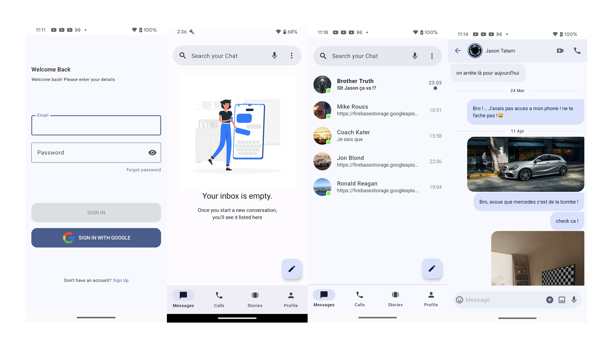

# Fellowship 💬

Fellowship is a simple yet powerful real-time chat application built with Android Jetpack Compose and Firebase. It supports rich communication features including text, audio, and video messaging, as well as audio and video calling.

This project is built using modern Android development tools and practices, following the MVVM architecture and leveraging Hilt (Dagger) for dependency injection.

## 📸 Screenshots



## ✨ Features

* 🔐 Authentication – Firebase Auth for secure login
* 💬 Chat – Send and receive text, audio, and video messages
* 📞 Calling – One-on-one audio and video calls
* 🟢 User Presence – Real-time online/offline status tracking
* 🔔 Push Notifications – Receive notifications when new messages arrive
* 🖼️ Media Support – Image/video preview with Coil and MediaPlayer
* 🎯 Modern Architecture – Built with MVVM, Jetpack Compose, and Hilt

## 🛠️ Tech Stack

* Jetpack Compose – Declarative UI toolkit for building native UIs
* Firebase – Authentication, Cloud Firestore, Firebase Storage, Cloud Messaging
* MVVM Architecture – For a clean separation of concerns
* Hilt (Dagger) – Dependency injection
* Coil – Image loading library for Jetpack Compose

## 🚀 Getting Started

To run this project:

1. Clone the repository:

  ```shell
  git clone https://github.com/Cyrus243/Fellowship.git
  ```

2. Open the project in Android studio and sync Gradle
   
3. Configure firebase:
   * Create a Firebase project.
   * Download your `google-services.json` file.
   * Place it in the `app/` directory.

 4. Build and run:
    * Connect a physical device or use an emulator.
    * Press Run ▶️ in Android Studio.

 ## 🤝 Contributions

   Pull requests are welcome! If you'd like to contribute, feel free to fork the repo and submit improvements.


